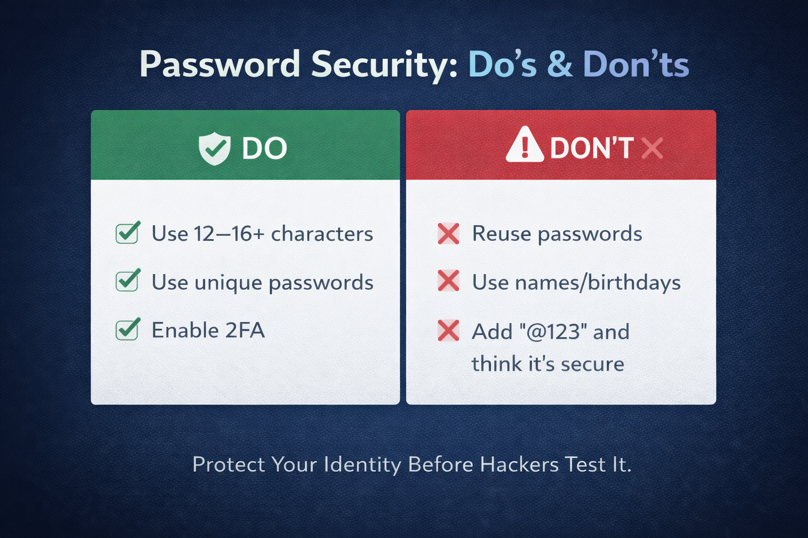

# Your Password Is Not as Strong as You Think --- And Hackers Know It

------------------------------------------------------------------------

------------------------------------------------------------------------

# Your Password Is Not as Strong as You Think --- And Hackers Know It

Ritika thought she was smart.

Her password wasn't "123456."
It was `Ritika@123`.

Capital letter? ✔
Number? ✔
Symbol? ✔

**Secure?**

Not even close.

Within minutes, her social media account was compromised.

What she didn't know is that **"Name + @123"** is one of the most
predictable password patterns in the world.

And hackers know it.

------------------------------------------------------------------------

## The Password Illusion

Most of us believe we're being careful.

But let's be honest --- how many of these have you used?

-   Your name + birth year
-   Your child's name
-   A pet's name
-   `India@123`
-   `Welcome@1`
-   One password for everything

We don't choose weak passwords because we're careless.
We choose them because they're easy to remember.

And that's exactly why attackers love them.

------------------------------------------------------------------------

## A Real Case: When One Breach Unlocks Everything

In 2021, Domino's India suffered a massive data breach. Reports stated
that data of over **180 million users** was exposed --- including names,
phone numbers, email addresses, and order details.

The breach was widely reported by major media outlets:

-   BBC News
    https://www.bbc.com/news/world-asia-india-57197992

-   The Indian Express
    https://indianexpress.com/article/technology/tech-news-technology/dominos-india-data-leak-7324568/

-   India Today
    https://www.indiatoday.in/technology/news/story/dominos-india-data-breach-of-18-crore-users-reported-1803380-2021-05-26

According to reports, the leaked database was allegedly put up for sale
on the dark web.

Now imagine this:

A customer used the same password for: - Their Domino's account
- Gmail
- Social media
- Online banking

If that password was part of the leaked data, hackers wouldn't need to
"hack" anything.

They would simply try the same email-password combination on other
platforms.

This technique is called **credential stuffing** --- and it works
because people reuse passwords.

**One leak Multiple compromised accounts.**

------------------------------------------------------------------------

## How Hackers Actually Break Passwords

Forget dramatic movie scenes.
Modern attacks are fast, automated, and silent.

### 1️⃣ Common Password Lists

Hackers use databases of the most used passwords:

    123456
    password
    qwerty
    admin
    welcome

If your password is common, it's cracked in seconds.

------------------------------------------------------------------------

### 2️⃣ Personal Information Guessing

Your social media reveals more than you think.

If your bio says:
"Proud mom of Aarav ❤️ | Born 2015"

And your password is:
`Aarav2015`

That's not security. That's predictability.

------------------------------------------------------------------------

### 3️⃣ Brute Force Tools

Automated software can test millions of combinations per second.

Short passwords (6--8 characters) are especially vulnerable.
Adding "@123" does not magically make them strong.

**Length matters more than decoration.**

------------------------------------------------------------------------

### 4️⃣ Phishing --- The Emotional Hack

Sometimes attackers don't break passwords.

They trick you into giving them away.

"Your bank account will be frozen. Click here to verify."

Urgency.
Fear.
Pressure.

You enter your password yourself.

Game over.

------------------------------------------------------------------------

## Why Most Password Advice Is Misleading

We were told: "Add a capital letter and a symbol."

So we did.

But patterns like:

-   `Name@123`
-   `India@2024`
-   `Welcome@1`

are already stored in cracking software databases.

Hackers don't guess randomly.
They test patterns.

And humans are predictable.

------------------------------------------------------------------------

## What Actually Makes a Password Strong?

A strong password:

-   ✔ Is at least 12--16 characters long
-   ✔ Is unique for every important account
-   ✔ Avoids personal information
-   ✔ Uses randomness, not patterns

Instead of:

`Sharma123`

Try:

`Blue$River!84Sun`

Even better --- use a password manager to generate and store complex
passwords.
You don't need to memorize everything anymore.

------------------------------------------------------------------------

## Real-Life Digital Rules

-   Never reuse passwords
-   Avoid names, birthdays, or obvious patterns
-   Enable two-factor authentication (OTP or authenticator apps)
-   Be cautious with urgent-looking links
-   Treat email security as top priority

Because once someone accesses your email, they can reset everything
else.

------------------------------------------------------------------------

## The Bigger Truth

Cybersecurity is not about coding.
It's about habits.

Most breaches don't happen because hackers are geniuses.
They happen because users are predictable.

Your password protects:

-   Your identity
-   Your money
-   Your photos
-   Your conversations
-   Your reputation

You wouldn't lock your house with "1234."

So why protect your digital life that way?

Your password is not just a login.

It's your first line of defense.

And hackers are counting on you to underestimate it.
