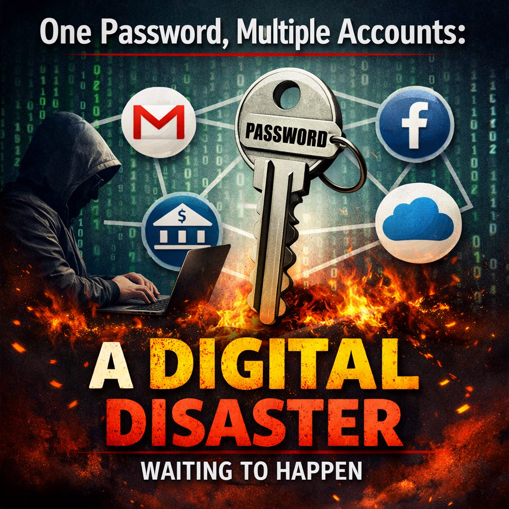

# One Password, Multiple Accounts: A Digital Disaster Waiting to Happen

Most people don't get hacked because hackers are genius programmers.
They get hacked because people reuse passwords.

It feels harmless.
It feels convenient.
But it can silently destroy your online life.

------------------------------------------------------------------------

## The Real Problem Isn't Weak Passwords --- It's Reused Passwords

You might think:

> "My password is strong. It has capital letters and numbers."

But here's the problem:

If you use that password on more than one website, it's no longer safe.

When one website gets hacked, your password may be leaked --- and
attackers will try it on other accounts.

------------------------------------------------------------------------

## The LinkedIn Case --- A Lesson for Everyone

In 2012, LinkedIn suffered a major data breach. Millions of user
passwords were leaked.

Many users had used the same password for:

-   LinkedIn
-   Gmail
-   Facebook
-   Banking apps

Hackers took the leaked email + password combinations and ran them on
other websites using automated tools.

This method is called **credential stuffing** and it works because
people reuse passwords.

------------------------------------------------------------------------

## What Is Credential Stuffing? (Simple Explanation)

Credential stuffing means:

Using stolen login details from one website to automatically try logging
into other websites.

Hackers use software that can:

-   Test thousands of logins per minute
-   Target email accounts first
-   Gain access to multiple accounts quickly

Once they get into your email, they can:

-   Reset your bank password
-   Reset social media accounts
-   Access personal documents
-   Pretend to be you

Email is the master key.
If your email shares the same password as LinkedIn the damage multiplies.

------------------------------------------------------------------------

## Why This Is a "Digital Disaster"

Think of it like using the same key for:

-   Your house
-   Your car
-   Your office
-   Your locker

Now imagine that key gets copied once.
Everything is exposed.

That's exactly what happens with password reuse.

**One breach.
One leak.
Multiple accounts compromised.**

------------------------------------------------------------------------

## Why People Still Reuse Passwords

-   It's easy to remember
-   They think "It won't happen to me"
-   They trust smaller websites

But attackers don't attack individuals first.
They attack databases.
Automated tools do the rest.

It's not personal.
It's mathematical.

------------------------------------------------------------------------

## The Simple Rule That Changes Everything

**One account = One password. Always.**

If remembering many passwords is hard, use a trusted password manager to
generate and store unique passwords.

Also, protect your email account with the strongest password and
two-factor authentication.

Your password is not just a login.
It is access to your identity.
And reusing it is a digital disaster waiting to happen.
